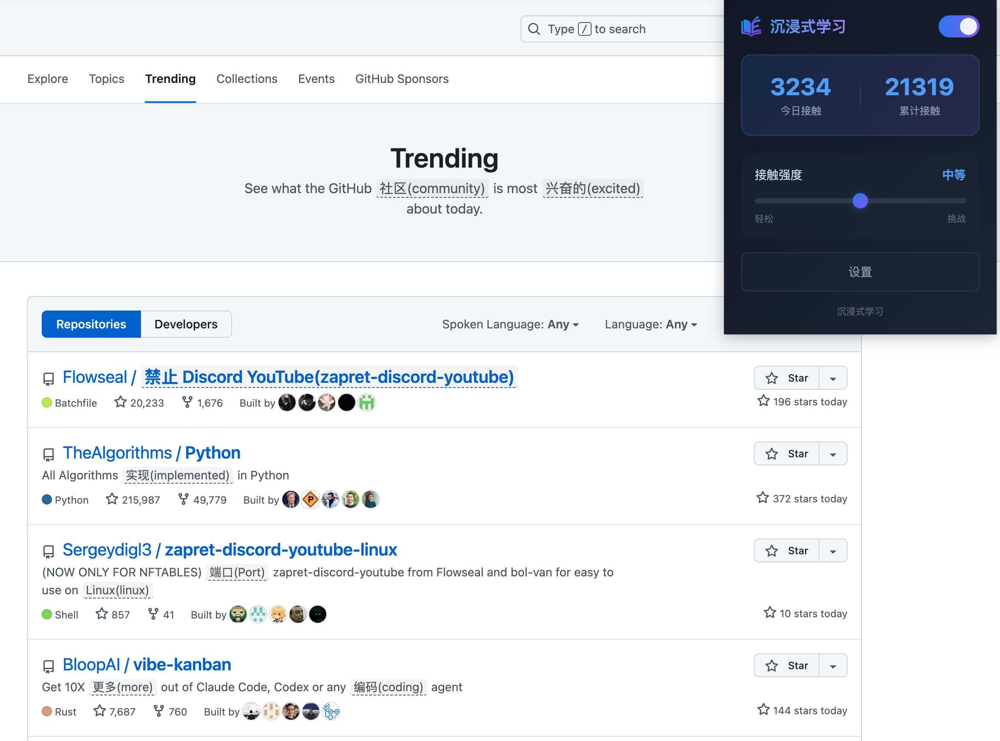

# Immersive Learning

> 沉浸式学习浏览器扩展 - 将英语自然融入你的日常浏览

## 效果展示



> [!IMPORTANT]
> 需要先在扩展设置中配置 AI 模型（API Key、API 地址）。

## 功能特点

- **AI 智能替换** - 使用 LLM 将网页中的部分中文词汇替换为英文
- **无缝学习** - 在浏览新闻、社交媒体时自然接触英语
- **悬浮提示** - 鼠标悬停显示中文原文
- **单词详情** - 点击单词查看音标、释义、例句
- **难度调节** - 5 档接触强度，从轻松到挑战
- **双向语言学习** - 支持母语→目标语言和目标语言→母语
- **页面语言检测** - 智能识别页面语言并调整翻译方向
- **多种显示样式** - 译文(原文)、原文(译文)、仅译文三种模式
- **多 API 配置** - 支持添加、编辑、删除多个 API 配置
- **配置导入导出** - 便捷的配置备份和迁移
- **黑/白名单模式** - 灵活的网站过滤策略，支持通配符
- **智能缓存** - LRU 缓存策略，减少 API 调用
- **学习统计** - 记录每日/累计接触词数
- **API 错误处理** - 连续失败自动关闭，避免不必要的请求

## 安装

### Chrome / Edge

1. 下载或克隆本项目
2. 打开浏览器，访问 `chrome://extensions/`（Edge 为 `edge://extensions/`）
3. 开启 **开发者模式**
4. 点击 **加载已解压的扩展程序**
5. 选择项目根目录

### 配置

1. 点击扩展图标打开设置面板
2. 输入 API Key（必需）
3. 配置 API 地址（可选，默认 api.openai.com）
4. 配置模型名称（可选，默认 gpt-4o-mini）
5. 调整接触强度
6. 配置排除网站列表（支持通配符如 `192.168.*.*`）
7. 保存设置

## 使用方式

1. 访问任意中文网页
2. 扩展自动处理页面内容，将部分词汇替换为英文
3. 替换的词汇显示为蓝色高亮
4. 鼠标悬停查看中文原文
5. 点击单词查看详细释义（音标、词性、例句）
6. 右键页面可快速「排除/取消排除当前网站」
7. 点击扩展图标查看学习统计

## 项目结构

```
learn-english/
├── manifest.json       # 扩展配置
├── background.js       # Service Worker
├── content/
│   ├── content.js      # 页面处理与AI模块
│   └── content.css     # 样式
├── popup/
│   ├── popup.html      # 弹窗界面
│   ├── popup.js        # 弹窗逻辑
│   └── popup.css       # 弹窗样式
└── icons/              # 图标文件
```

## 技术栈

- Chrome Extension Manifest V3
- Vanilla JavaScript
- OpenAI Compatible API

## License

MIT
